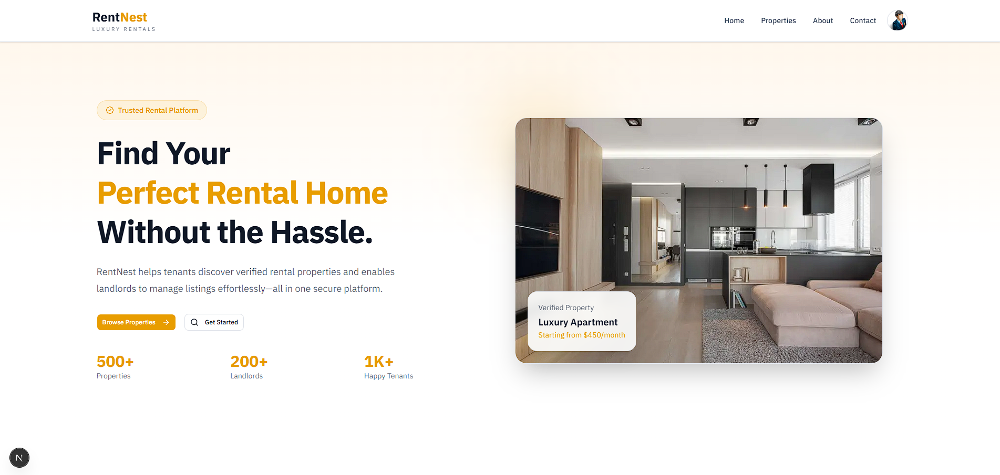
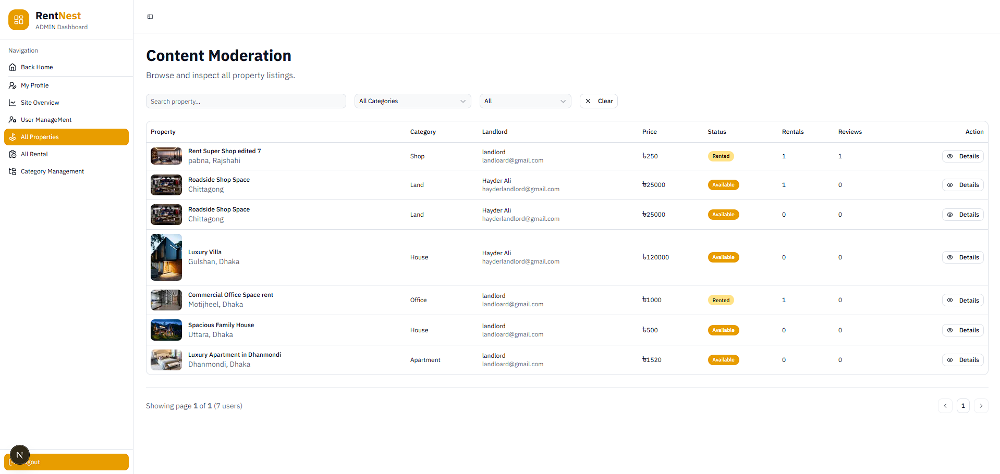

# 🏠 RentNest

> **RentNest** is a modern full-stack property rental platform built with **Next.js 16**, **React 19**, **TypeScript**, **Tailwind CSS**, and **shadcn/ui**. It provides a seamless rental experience for **Tenants**, **Landlords**, and **Admins** with secure authentication, online payments, property management, and role-based dashboards.

---

## 🌐 Live Demo

### 🖥️ Frontend

👉 https://rent-nest-nextjs-frontend.vercel.app

### ⚙️ Backend API

👉 https://rentnest-backend-fui8.onrender.com

---

---

## 📱 Mobile Apps

- 📥 [](https://rent-nest-nextjs-frontend.vercel.app/RentNest.apk)
- ☁️ **Google Drive:** [Download from Drive](https://drive.google.com/file/d/1544aCNwIs5MLCq6wuaZqpWRM71kzCzW7/view?usp=sharing)

---

# 📸 Preview

> Add your screenshots here.

| Home Page              | Dashboard                   |
| ---------------------- | --------------------------- |
|  |  |

---

# ✨ Features

## 👤 Authentication

- 🔐 JWT Authentication
- 🍪 HTTP Only Cookie Authentication
- 📝 Register & Login
- 🚪 Logout
- 🔒 Protected Routes
- 🎭 Role Based Authorization

---

## 🏘️ Public Features

- 🏠 Browse Properties
- 🔎 Search Properties
- 📂 Filter by Category
- 📍 Filter by Location
- 💰 Filter by Price
- 📄 Property Details
- 📱 Fully Responsive UI

---

## 👨‍💼 Tenant Features

- 🏠 Browse Available Properties
- 📩 Send Rental Request
- 💳 Secure Stripe Payment
- 📜 Payment History
- ⭐ Leave Review
- 👤 Profile Management
- 📄 My Rental Requests

---

## 🏢 Landlord Features

- ➕ Add Property
- ✏️ Update Property
- 🗑️ Delete Property
- 📋 Manage Properties
- ✅ Approve Rental Requests
- ❌ Reject Rental Requests
- 🔄 Complete Rental
- 👤 Profile Management

---

## 🛠️ Admin Features

### 📊 Dashboard Overview

- 👥 Total Users
- 🏠 Total Properties
- 💵 Total Revenue
- ⏳ Pending Rentals
- ✅ Active Rentals
- 🎉 Completed Rentals

### 👥 User Management

- 🔍 Search Users
- 🎭 Filter by Role
- 🚦 Filter by Status
- 📄 Pagination
- 🚫 Block User
- ✅ Unblock User

### 🏠 Content Moderation

- 📋 All Properties
- 📋 All Rental Requests
- 🔍 Search
- 🎯 Filters
- 📄 Pagination
- 👀 Details Dialog

### 🗂️ Category Management

- ➕ Create Category
- ✏️ Update Category
- 🗑️ Delete Category
- 📊 Property Count

---

# 🚀 Tech Stack

## Frontend

- ⚛️ Next.js 16 (App Router)
- ⚛️ React 19
- 🔷 TypeScript
- 🎨 Tailwind CSS v4
- 🧩 shadcn/ui
- 🧾 React Hook Form
- ✅ Zod
- 🍞 Sonner
- 🎯 Lucide Icons
- ⚛️ Tanstack-Query

---

## Backend

- 🚀 Node.js
- ⚡ Express.js
- 🔷 TypeScript
- 🗄️ PostgreSQL
- 🔺 Prisma ORM
- 🔐 JWT Authentication
- 🔒 bcryptjs
- 💳 Stripe Payment Gateway

---

# 📁 Project Structure

```bash
app
components
hooks
lib
schemas
providers
public
```

---

# ⚙️ Environment Variables

Create a `.env.local` file.

```env
BACKEND_API_URL=http://localhost:5000

NEXT_PUBLIC_STRIPE_PUBLISHABLE_KEY=your_key

NEXT_PUBLIC_IMGBB_API_KEY=your_key

JWT_ACCESS_SECRET=Your beckend secret

JWT_REFRESH_SECRET=Your beckend secret
```

---

# 📦 Installation

Clone the project

```bash
git clone https://github.com/Hayder987/RentNest_nextjs_frontend
```

Go to project

```bash
cd rentnest-frontend
```

Install dependencies

```bash
npm install
```

or

```bash
pnpm install
```

Start development server

```bash
npm run dev
```

---

# 📜 Available Scripts

```bash
npm run dev

npm run build

npm run start

npm run lint
```

---

# 🔒 User Roles

| Role        | Permissions                                    |
| ----------- | ---------------------------------------------- |
| 👤 Tenant   | Browse properties, Rent, Pay, Review           |
| 🏢 Landlord | Manage properties & rental requests            |
| 🛠️ Admin    | Manage users, categories, properties & rentals |

---

# 💳 Payment

- 💳 Stripe Checkout
- ✅ Secure Payment
- 📜 Payment History
- 🧾 Transaction Tracking

---

# 🎯 Validation

- ✅ React Hook Form
- ✅ Zod Validation
- ✅ Server Actions
- ✅ Error Handling

---

# 📱 Responsive Design

Works perfectly on

- 💻 Desktop
- 💼 Laptop
- 📱 Mobile
- 📟 Tablet

---

# 🚀 Performance

- ⚡ Next.js App Router
- ⚡ Server Components
- ⚡ Server Actions
- ⚡ Route Loading
- ⚡ Skeleton Loading
- ⚡ Image Optimization
- ⚡ Code Splitting

---

# 🛡️ Security

- 🔐 JWT Authentication
- 🍪 HTTP Only Cookies
- 🔒 Protected Routes
- 🎭 Role Based Access
- ✅ Server-side Validation

---

# 📚 API Documentation

Backend API includes endpoints for:

- 👤 Authentication
- 🏠 Properties
- 📂 Categories
- 📩 Rental Requests
- 💳 Payments
- ⭐ Reviews
- 👥 Users
- 📊 Admin Dashboard

---

# 👨‍💻 Developed By

**Hayder Ali**

- 💼 Full Stack Developer
- 💻 GitHub: https://github.com/Hayder987
- ✉️ Email: hayderbd4290@gmail.com

---

# ⭐ Support

If you like this project, don't forget to ⭐ the repository.

---

# 📄 License

This project is developed for educational purposes.
